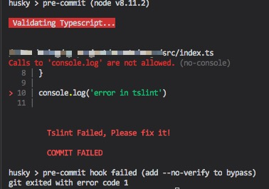

# Husky-tslint-pre-commit

## Usage

`yarn add husky-tslint-pre-commit`

or

`npm install husky-tslint-pre-commit`

## Desc

- use [husky](https://github.com/typicode/husky) to hook `pre-commit`
- use [tslint](https://github.com/palantir/tslint) to lint code in `pre-commit`
